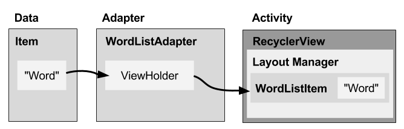

# Tutorial RecycleView with CardView Java

## introduction

 <b>About RecyclerView</b>
<p>RecyclerView adalah salah satu komponen ui di Android yang sering digunakan dalam sebuah aplikasi. Karena komponen ini digunakan untuk membuat sebuah app yang didalamnya terdapat list atau daftar yang dapat discroll ke atas ke bawah atau ke kanan ke kiri.<p>
<hr>
 <b>Komponen-Komponen RecycleView</b>
<br>- Data
<br>- RecylerView
<br>- Layout untuk satu item data
<br>- Pengelola layout
<br>- Adapter
<br>- View holder
<br>

<br>
<b>About CardView</b>
<p>CardView merupakan view paketan dari Material Design — diperkenalkan pada Android Versi Lolipop. Bentuk view ini biasa digunakan untuk pembungkusan data (sepaket data — beberapa view) yang ditandai dengan tampilan view nya yang memiliki drop shadow (elevation) dan corner radius. Adapun CardView ini merupakan subclass dari FrameLayout.</p>

<b> About Picasso</b>
<p>Picasso (nama yang terinspirasi oleh seniman Perancis terkenal Pablo Picasso) adalah pustaka Android open-source yang sangat populer untuk memuat gambar di aplikasi Android Anda
<br>
Picasso memungkinkan pemuatan gambar tanpa kerumitan dalam aplikasi Anda—sering kali dalam satu baris kode!
Perhatikan bahwa Picasso menggunakan OkHttp (perpustakaan jaringan dari pengembang yang sama) di bawah tenda untuk memuat gambar melalui internet.</p>

## Mengimplementasikan RecyclerView

<b>Menambahkan Dependensi RecylerView, cardview, dan Picasso</b>
<br>Pertama kita tambahkan dependencies dalam gradle, lalu lakukan Sync Now.

```xml
    implementation 'com.android.support:recyclerview-v7:28.0.0'
    implementation 'com.android.support:cardview-v7:28.0.0'
    implementation 'com.squareup.picasso:picasso:2.71828'
```

<b>Tambahkan RecyclerView ke layout</b>
<br>Kemudian kita tambahkan RecyclerView pada activity_main.xml kita :
```xml
     <?xml version="1.0" encoding="utf-8"?>
	<RelativeLayout xmlns:android="http://schemas.android.com/apk/res/android"
    	xmlns:app="http://schemas.android.com/apk/res-auto"
    	xmlns:tools="http://schemas.android.com/tools"
    	android:layout_width="match_parent"
    	android:layout_height="match_parent"
    	tools:context=".MainActivity">

        <android.support.v7.widget.RecyclerView
        android:id="@+id/recycler_view"
        android:layout_width="match_parent"
        android:layout_height="match_parent"/>

     </RelativeLayout>
```
<b>Buat Model Class</b>
<br>Langkah selanjutnya membuat model class.
```java
      package app.andropath.com.recyclerviewexample;

public class KontakModel {

    private String nama;
    private String nohp;
    private String img;

    public KontakModel(String nama, String nohp, String img) {
        this.nama = nama;
        this.nohp = nohp;
        this.img = img;
    }

    public String getNama() {
        return nama;
    }

    public void setNama(String nama) {
        this.nama = nama;
    }

    public String getNohp() {
        return nohp;
    }

    public void setNohp(String nohp) {
        this.nohp = nohp;
    }

    public String getImg() {
        return img;
    }

    public void setImg(String img) {
        this.img = img;
    }
}

```
<br><b>Buat layout untuk list_item</b>
<br>Setelah itu mari kita buat layout untuk view item-nya.
```xml
     <?xml version="1.0" encoding="utf-8"?>


<android.support.v7.widget.CardView xmlns:android="http://schemas.android.com/apk/res/android"
    xmlns:card_view="http://schemas.android.com/apk/res-auto"
    android:layout_width="match_parent"
    android:layout_height="wrap_content"
    card_view:cardCornerRadius="6dp"
    card_view:cardElevation="3dp"
    card_view:cardUseCompatPadding="true">

    <LinearLayout
        android:layout_width="match_parent"
        android:layout_height="wrap_content"
        android:layout_margin="5dp"
        android:orientation="horizontal"
        android:padding="5dp">

        <ImageView
            android:id="@+id/imgView"
            android:layout_width="50dp"
            android:layout_height="50dp"
            android:layout_gravity="center_vertical|center_horizontal"
            android:layout_margin="4dp"
            android:adjustViewBounds="true"
            android:scaleType="centerCrop"
            android:src="@drawable/ic_launcher_foreground" />

        <LinearLayout
            android:layout_width="wrap_content"
            android:layout_height="wrap_content"
            android:layout_margin="10dp"
            android:orientation="vertical">

            <TextView
                android:id="@+id/txt_nama_kontak"
                android:layout_width="match_parent"
                android:layout_height="wrap_content"
                android:text="Nama" />

            <TextView
                android:id="@+id/txt_nohp_user"
                android:layout_width="match_parent"
                android:layout_height="wrap_content"
                android:text="Nomer Telp" />

        </LinearLayout>
    </LinearLayout>

</android.support.v7.widget.CardView>
```
<br><b>Buat adapter dengan view holder</b>
```java
      package app.andropath.com.recyclerviewexample;

import android.media.Image;
import android.support.v7.widget.RecyclerView;
import android.view.LayoutInflater;
import android.view.View;
import android.view.ViewGroup;
import android.widget.ImageView;
import android.widget.TextView;

import com.squareup.picasso.Picasso;

import java.util.ArrayList;

public class KontakAdapter extends RecyclerView.Adapter<KontakAdapter.MahasiswaViewHolder> {


    private ArrayList<KontakModel> dataList;

    public KontakAdapter(ArrayList<KontakModel> dataList) {
        this.dataList = dataList;
    }

    @Override
    public MahasiswaViewHolder onCreateViewHolder(ViewGroup parent, int viewType) {
        LayoutInflater layoutInflater = LayoutInflater.from(parent.getContext());
        View view = layoutInflater.inflate(R.layout.kontak_list, parent, false);
        return new MahasiswaViewHolder(view);
    }

    @Override
    public void onBindViewHolder(MahasiswaViewHolder holder, int position) {
        final KontakModel kontakModel = dataList.get(position);

        holder.txtNama.setText(dataList.get(position).getNama());
        holder.txtNoHp.setText(dataList.get(position).getNohp());
        Picasso.get().
                load(kontakModel.getImg()).
                placeholder(R.drawable.progress_animation).
                error(R.drawable.ic_launcher_foreground).
                fit().
                into(holder.imgView);


    }

    @Override
    public int getItemCount() {
        return (dataList != null) ? dataList.size() : 0;
    }

    public class MahasiswaViewHolder extends RecyclerView.ViewHolder{
        private TextView txtNama, txtNoHp;
        public ImageView imgView;

        public MahasiswaViewHolder(View itemView) {
            super(itemView);
            txtNama = (TextView) itemView.findViewById(R.id.txt_nama_kontak);
            txtNoHp = (TextView) itemView.findViewById(R.id.txt_nohp_user);
            imgView  = (ImageView) itemView.findViewById(R.id.imgView);
        }
    }
}
```
<br><b>Menambhakan recyclerview di MainAcitivy</b>
```java
      package app.andropath.com.recyclerviewexample;

import android.support.v7.app.AppCompatActivity;
import android.os.Bundle;
import android.support.v7.widget.LinearLayoutManager;
import android.support.v7.widget.RecyclerView;

import java.util.ArrayList;

public class MainActivity extends AppCompatActivity {

    private RecyclerView recyclerView;
    private KontakAdapter adapter;
    private ArrayList<KontakModel> kontakModelArrayList;

    @Override
    protected void onCreate(Bundle savedInstanceState) {
        super.onCreate(savedInstanceState);
        setContentView(R.layout.activity_main);

        addData();

        recyclerView = (RecyclerView) findViewById(R.id.recycler_view);

        adapter = new KontakAdapter ( kontakModelArrayList );

        RecyclerView.LayoutManager layoutManager = new LinearLayoutManager(MainActivity.this);

        recyclerView.setLayoutManager(layoutManager);

        recyclerView.setAdapter(adapter);
    }

    void addData(){
        kontakModelArrayList = new ArrayList<>();
        kontakModelArrayList.add(new KontakModel ("Sholeh", "085367406370", "https://carlisletheacarlisletheatre.org/images/person-clipart-circle-9.png"));
        kontakModelArrayList.add(new KontakModel ("Ana", "089637370534", "https://carlisletheacarlisletheatre.org/images/user-icon-avatar-9.png"));
        kontakModelArrayList.add(new KontakModel ("Tamin", "087121423034", "https://carlisletheacarlisletheatre.org/images/user-icon-avatar-5.png"));
        kontakModelArrayList.add(new KontakModel ("Anang", "083437809858", "https://carlisletheacarlisletheatre.org/images/user-icon-avatar-6.jpg"));
    }

}
```
<b>Menambah user-permission di Manifests agar aplikasi dapat mengakses internet</b>
```xml
      <uses-permission android:name="android.permission.INTERNET"/>
```
<b>Hasil Output</b>
Silahkan jalankan kode program yang telah anda ketik pada program anda. Dan hasil yang diharapkan adalah seperti berikut : 
<br>


## Refrensi
1. https://code.tutsplus.com/id/tutorials/code-an-image-gallery-android-app-with-picasso--cms-30966
2. https://medium.com/easyread/tutorial-android-recyclerview-dan-cardview-9a62aaa6cc0c
3. https://google-developer-training.github.io/android-developer-fundamentals-course-concepts/idn/Unit%202/44_c_recyclerview.html
